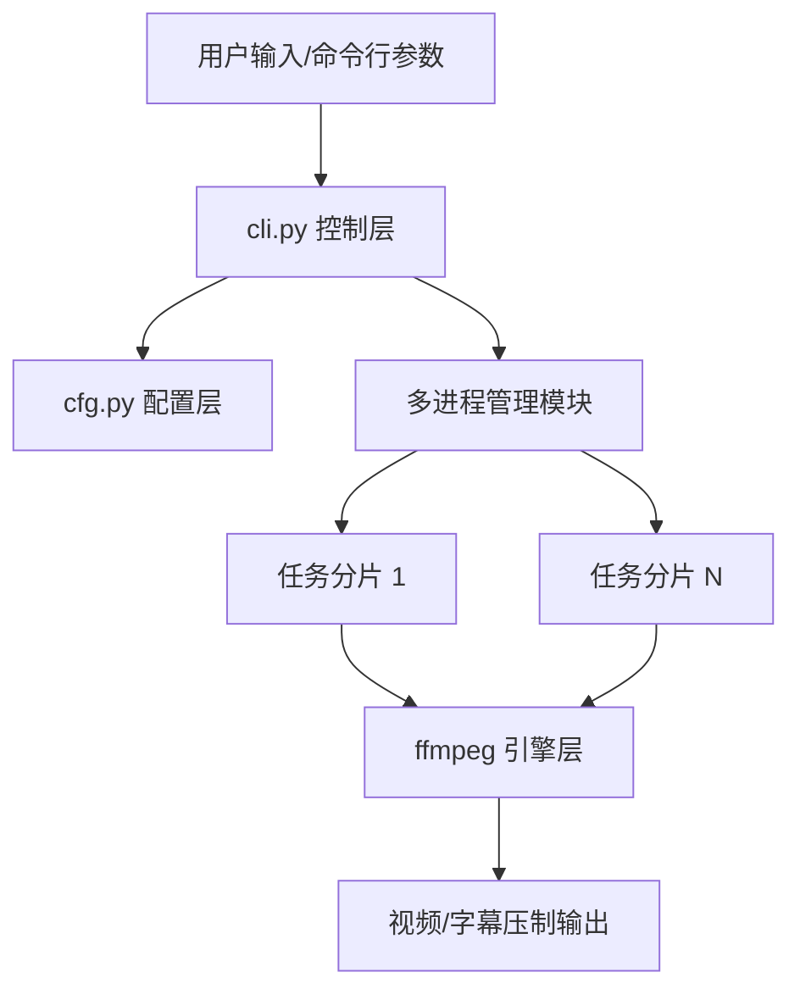
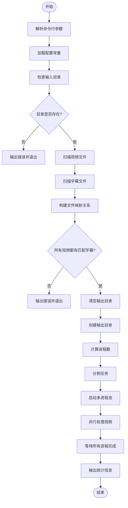
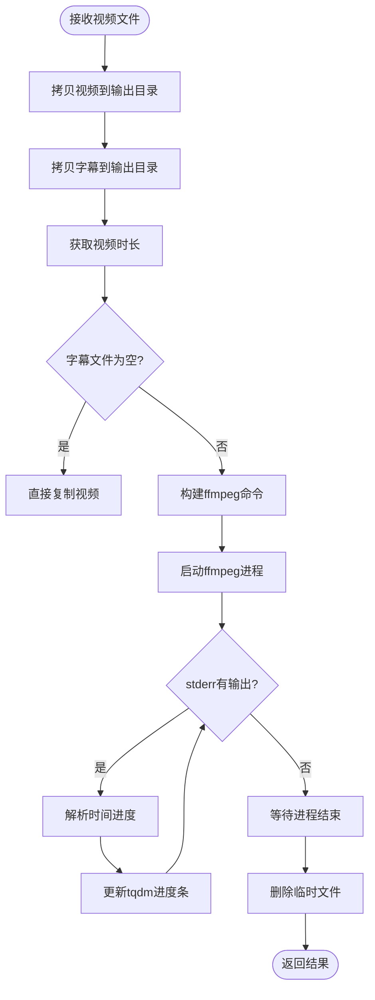
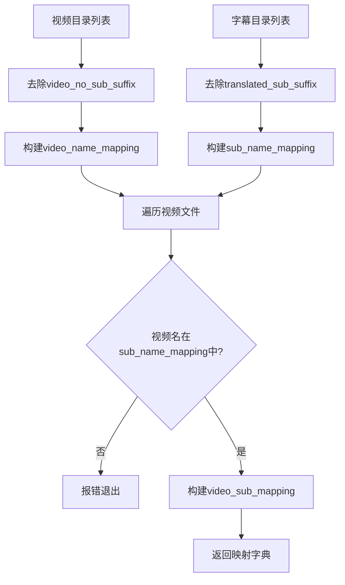
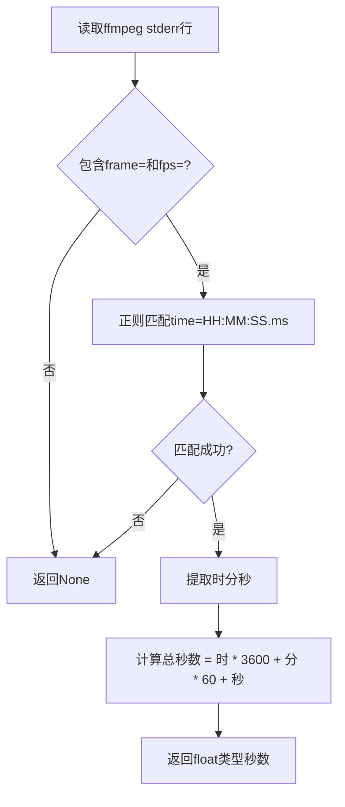
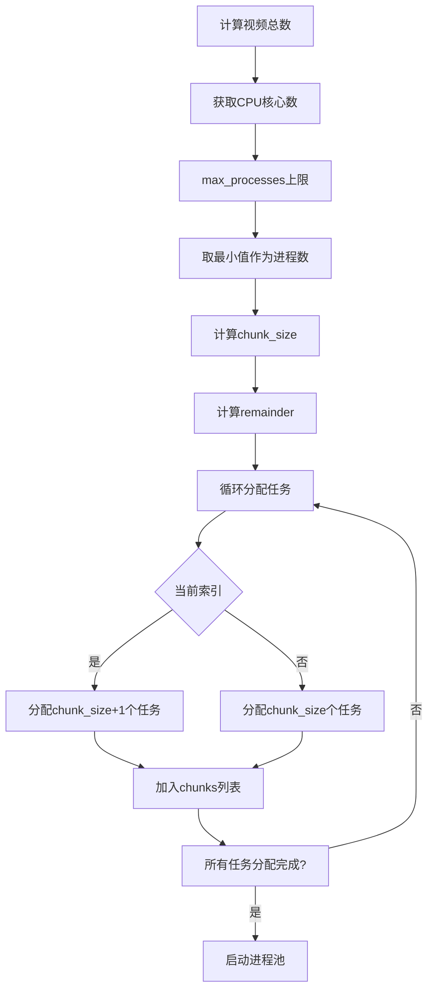
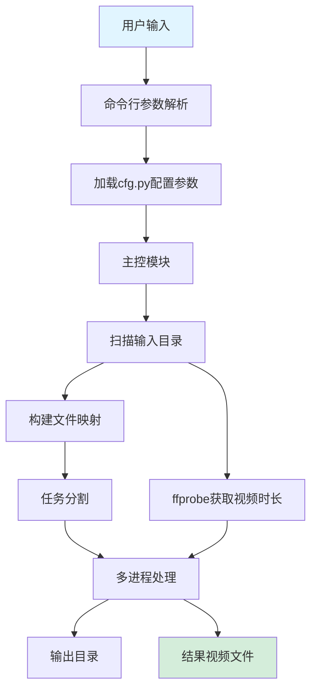

# 操作手册

<style>
/* Keep table border at PDF printing */
table { border-collapse: collapse; }
table, th, td { border: 1px solid #333; }
th, td { padding: 4px 8px; vertical-align: top; }
</style>

## 如何登录
本软件为基于 Python 开发的自动化命令行工具（CLI），无需账号登录体系。
1. **环境检查**：确保系统已安装 Python 3.10+ 及 FFmpeg 工具（需添加至系统环境变量）。
2. **启动程序**：打开终端（Terminal / Command Prompt），切换至项目根目录。
3. **运行命令**：输入 `python cli.py` 即可启动任务。

## 主界面
软件采用简洁的命令行交互界面，实时反馈任务状态。
1. **初始化信息**：启动后，界面会显示检测到的待处理视频总数及分配的并行进程数。
2. **实时进度条**：利用 `tqdm` 库为每个视频任务提供动态进度条，包含：
   - 正在处理的视频文件名。
   - 完成百分比。
   - 预计剩余时间（ETA）。
   - 处理速度（iteration/s）。
3. **任务汇总**：所有任务完成后，界面会打印总耗时（格式化为 H/M/S）。

<div style="break-after: page;"></div>

# 设计说明

## 软件结构图
软件采用典型的分层架构设计，确保配置与逻辑分离。



<div style="break-after: page;"></div>

## 各功能流程图
以下为程序运行的核心业务流程。

<div style="break-inside: avoid; page-break-inside: avoid;">

### 1. 主流程图



</div>

### 2. 单视频处理流程图



<div style="break-after: page;"></div>

## 各功能逻辑框图

### 1. 文件映射模块逻辑



### 2. 进度解析模块逻辑



### 3. 多进程调度逻辑



<div style="break-after: page;"></div>

## 软件总体设计

### 1. 架构设计

软件采用主从进程架构。
* 主进程：负责任务调度、文件映射、目录管理
* 工作进程：负责具体视频处理任务
* 通信机制：通过进程池共享数据，无直接IPC通信

### 2. 模块划分

| 模块   | 文件     | 功能描述                    |
|------|--------|-------------------------|
| 配置模块 | cfg.py | 存储目录路径、文件后缀、处理参数        |
| 主控模块 | cli.py | 程序入口，参数解析，流程控制          |
| 处理模块 | cli.py | process_files函数，单视频处理逻辑 |
| 工具模块 | cli.py | parse_progress辅助函数      |

### 3. 关键技术

* ffmpeg: 视频编码与字幕烧录核心
* multiprocessing: Python多进程并行处理
* tqdm: 进度条可视化
* 正则表达式: 解析ffmpeg输出

### 4. 数据流



<div style="break-after: page;"></div>

## 模块名称功能

### 1. cfg.py - 配置模块

| 常量名                         | 类型  | 功能说明           |
|-----------------------------|-----|----------------|
| video_no_sub_dir            | str | 无字幕视频输入目录名     |
| translated_sub_dir          | str | 翻译字幕输入目录名      |
| video_translated_sub_dir    | str | 带字幕视频输出目录名     |
| video_no_sub_suffix         | str | 无字幕视频文件后缀标识    |
| translated_sub_suffix       | str | 翻译字幕文件后缀标识     |
| video_translated_sub_suffix | str | 输出视频文件后缀标识     |
| max_processes               | int | 最大并行进程数限制      |
| alignment                   | int | 字幕对齐方式(ffmpeg) |
| font_size                   | int | 字幕字体大小(像素)     |
| margin_v                    | int | 字幕垂直边距(像素)     |

### 2. cli.py - 主控与处理模块

#### 2.1. 主流程函数

| 函数名  | 功能描述          |
|------|---------------|
| main | 程序入口，协调整个处理流程 |

#### 2.2. 核心处理函数

| 函数名           | 参数                                                                    | 返回值  | 功能描述            |
|---------------|-----------------------------------------------------------------------|------|-----------------|
| process_files | video_dir, files, subtitle_dir, video_sub_dir, vn_mapping, vs_mapping | None | 批量处理视频文件，执行字幕烧录 |

#### 2.3. 工具函数

| 函数名            | 参数               | 返回值        | 功能描述                     |
|----------------|------------------|------------|--------------------------|
| parse_progress | line(str)        | float/None | 解析ffmpeg stderr输出，提取时间进度 |
| nice_time_cost | time_cost(float) | str        | 格式化秒数为易读时间字符串            |

<div style="break-after: page;"></div>

## 函数名称功能

### 1. process_files函数
> **process_files(video_dir, files, subtitle_dir, video_sub_dir, vn_mapping, vs_mapping)**
* 功能：处理一批视频文件，将字幕烧录到视频中
* 参数说明：
  * video_dir: 源视频目录路径
  * files: 待处理的视频文件名列表
  * subtitle_dir: 字幕文件源目录
  * video_sub_dir: 处理过程中的工作目录
  * vn_mapping: 视频文件名到视频名的映射字典
  * vs_mapping: 视频文件名到字幕文件名的映射字典
* 处理逻辑：
  * 遍历视频文件列表
  * 拷贝视频和字幕文件到工作目录
  * 使用 ffprobe 获取视频时长
  * 字幕为空时直接复制视频
  * 字幕非空时启动 ffmpeg 进行烧录
  * 实时解析 ffmpeg 输出更新进度条
  * 清理临时文件

### 2. parse_progress函数
> **parse_progress(line)**
* 功能：从ffmpeg输出中提取时间进度
* 算法：正则表达式匹配
  * 模式：r"time=(\d+):(\d+):(\d+.\d+)"
  * 匹配"time=HH:MM:SS.ms"格式
  * 转换为总秒数返回
* 返回值：
  * 成功：float类型秒数
  * 失败：None

<div style="break-after: page;"></div>

### 3. nice_time_cost函数
> **nice_time_cost(time_cost)**
* 功能：将秒数格式化为易读字符串
* 格式化规则：
  * ≥3600秒：显示"Xh Ym Zs"
  * ≥60秒：显示"Xm Ys"
  * 其他：显示"Xs"
  * 0秒：显示"0s"

<div style="break-after: page;"></div>

## 算法

### 1. 文件映射算法
```
# 视频文件名映射
视频名 = 视频文件名.replace("_no_sub.mp4", "")

# 字幕文件名反向映射
视频名 → 字幕文件名

# 配对验证
for 每个视频文件:
    if 视频名 not in 字幕映射:
        # 报错退出
```
* 时间复杂度：O(n+m)，n为视频数，m为字幕数
* 空间复杂度：O(n+m)，存储两个字典

### 2. 任务分割算法
```
num_processes = min(视频总数, CPU核心数, max_processes)
chunk_size = 视频总数 // num_processes
remainder = 视频总数 % num_processes
for i in range(num_processes):
    if i < remainder:
        # 分配 chunk_size + 1 个任务
    else:
        # 分配 chunk_size 个任务
```
* 设计目的：实现负载均衡，前remainder个进程多处理1个任务

### 3. 进度计算算法
```
# ffmpeg输出解析
匹配模式: time=(\d+):(\d+):(\d+.\d+)
总秒数 = 小时×3600 + 分钟×60 + 秒

# 进度更新
增量 = 当前进度 - 上次进度
if 增量 > 0:
    # 更新进度条
    上次进度 = 当前进度
```
* 精度：0.01秒
* 更新频率：取决于ffmpeg输出缓冲区

### 4. 异常处理策略
| 异常类型       | 处理方式         | 影响范围   |
|------------|--------------|--------|
| 目录不存在      | sys.exit(0)  | 整个程序终止 |
| 视频无匹配字幕    | sys.exit(0)  | 整个程序终止 |
| 字幕文件为空     | 跳过烧录，直接复制    | 仅当前视频  |
| ffmpeg执行失败 | 进程返回非0，无特殊处理 | 仅当前视频  |

<div style="break-after: page;"></div>

## 运行设计

### 1. 运行环境要求
* 操作系统：Windows / Linux
* Python版本：3.10+
* 依赖库：
  * tqdm ≥ 4.0.0
  * ffmpeg ≥ 4.0 (系统命令行工具)
  * ffprobe (ffmpeg 附带工具)

### 2. 目录结构要求
```
项目根目录/
├── cfg.py
├── cli.py
├── videos_no_sub/          # 无字幕视频
│   ├── video1_no_sub.mp4
│   └── video2_no_sub.mp4
├── subtitles_translated/   # 翻译字幕
│   ├── video1_translated.srt
│   └── video2_translated.srt
└── videos_translated_sub/  # 输出目录(自动生成)
    ├── video1_translated_sub.mp4
    └── video2_translated_sub.mp4
```

### 3. 命令行使用方式
```
# 默认方式
python cli.py

# 自定义目录
python cli.py \
    --video-no-sub-dir /path/to/videos \
    --translated-sub-dir /path/to/subs \
    --video-translated-sub-dir /path/to/output
```

### 4. 性能指标
* 并行度：min(视频数, CPU核心数, max_processes)
* 内存占用：每个进程约等于单个视频大小
* 处理速度：取决于ffmpeg编码速度和视频时长
* I/O模式：先复制后处理，保证源文件安全

### 5. 日志与反馈
* 控制台输出：处理视频数量、时间统计
* 进度显示：每个视频独立tqdm进度条
* 错误处理：关键错误直接退出并打印原因
* 时间统计：整体耗时格式化显示

### 6. 安全设计
* 源文件保护：不在原视频上直接修改，始终拷贝后处理
* 临时文件清理：无论成功失败都会删除工作目录临时文件
* 目录隔离：输入输出目录分离，避免数据污染
* 进程隔离：多进程独立运行，互不影响
